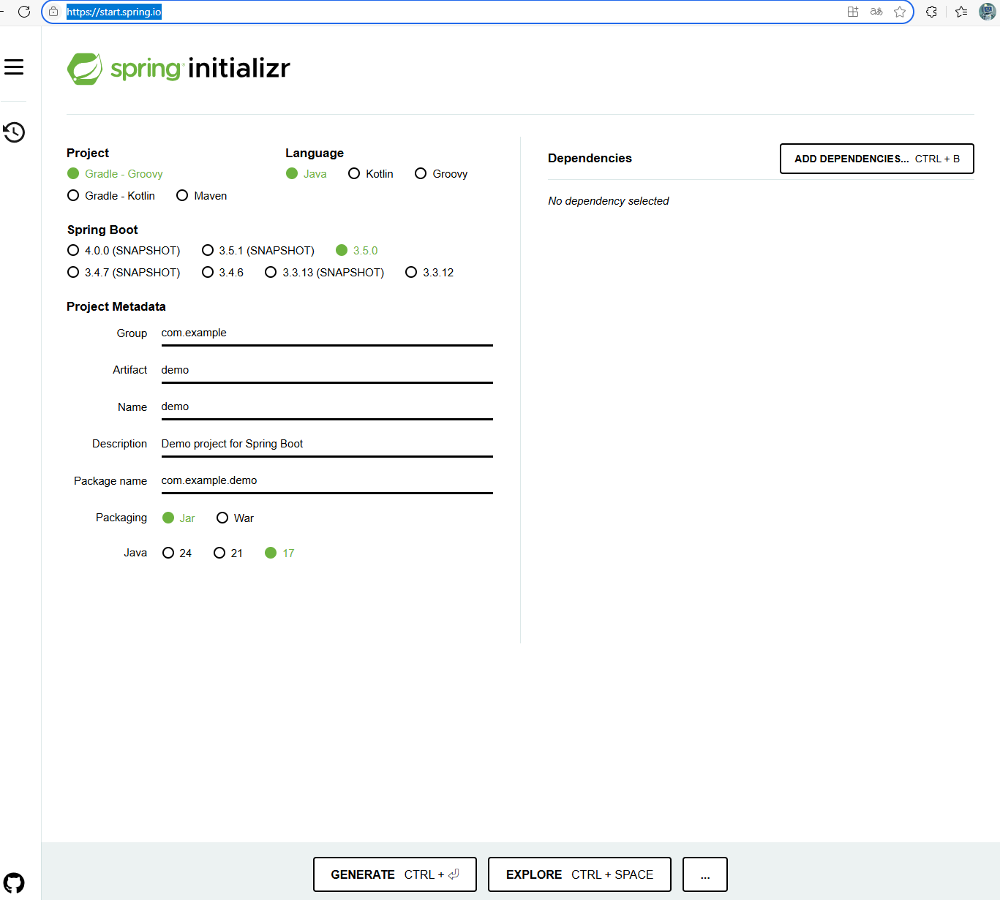

# Springboot 快速入门

### https://spring.io/quickstart

### 在页面点击下面这个链接，创建项目文件包

### https://start.spring.io/

### 如下图所示，在增加依赖（Dependencies）的列表中加入 “Spring Web”，其它用默认选项，生成文件包并且下载


### 将下载的文件（demo.zip) 解压缩。然后 用VS Code 打开这个folder。

### 如果之前创建文件包的时候没有增加Spring Web的依赖。那么也可以打开build.gradle文件，查看其中的dependencies一段，增加下面这样

implementation 'org.springframework.boot:spring-boot-starter-web'

### 完成后的dependencies一段是这样：
```
dependencies {
	implementation 'org.springframework.boot:spring-boot-starter'
    implementation 'org.springframework.boot:spring-boot-starter-web'
	testImplementation 'org.springframework.boot:spring-boot-starter-test'
	testRuntimeOnly 'org.junit.platform:junit-platform-launcher'
}
```

### 如果安装的Java版本也不是上面选择的，也可以在build.gradle文件里修改

```
java {
	toolchain {
		languageVersion = JavaLanguageVersion.of(21)
	}
}
```

### 接下来，按照快速入门网页里的步骤修改代码并且执行

```
package com.example.demo;

import org.springframework.boot.SpringApplication;
import org.springframework.boot.autoconfigure.SpringBootApplication;
import org.springframework.web.bind.annotation.GetMapping;
import org.springframework.web.bind.annotation.RequestParam;
import org.springframework.web.bind.annotation.RestController;


@SpringBootApplication
@RestController
public class DemoApplication {

	public static void main(String[] args) {
		SpringApplication.run(DemoApplication.class, args);
	}

	@GetMapping("/hello")
	public String hello(@RequestParam(value="name", defaultValue = "世界") String name) {
		return String.format("Hello, %s!", name);
	}

}
```


### 运行命令

gradlew.bat bootRun

### 启动web服务（默认端口是8080）

### 通过下面链接打开

### http://localhost:8080/hello


### 上面的代码中，用到了注解annotation功能。关于annotation的用法，学习下面的链接

### SpringBoot 注解

### https://www.cainiaojc.com/springboot/springboot-annotations.html